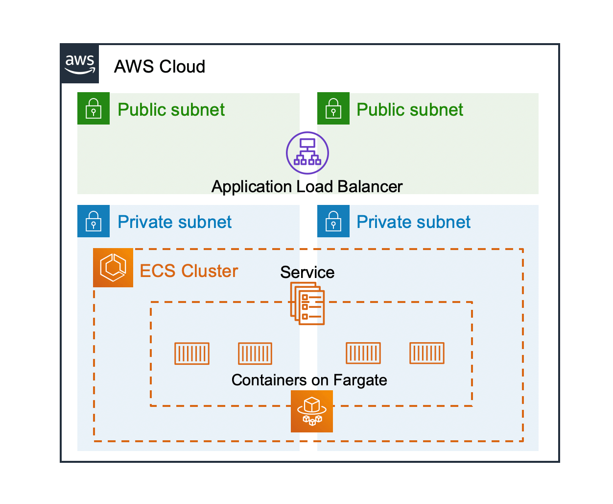

# gRPCサーバーをAWS上で動かす

# この章について

せっかく作ったサーバーは、ローカルだけではなくてリモートで動かしてみたいですよね。
そのため今回はAWS上でgRPCサーバーを動かす環境を紹介します。

# ロードバランサの設定

## 前提条件

gRPCサーバーを動かすコンピューティングリソースにどれを選んだとしても、現実的にはALB経由でそのサービスを公開することになるかと思います。

{.msg-icon}


以前はクライアント-ALB間がHTTP/2だったとしても、ALB-ターゲットグループ間の通信でHTTP/1.1になってしまうため、gRPCワークロードにルーティングするのにALBは採用できず、NLBを使うしかありませんでした。
しかし2020年10月から、ALB-ターゲットグループ間の通信にHTTP/2を使えるようになるアップデートが入りました。
これによりend-to-endでのHTTP/2通信が可能になり、gRPCのトラフィックをALBでルーティングすることができるようになったのです。

出典:[AWS公式 Application Load Balancer が、gRPC
ワークロードをエンドツーエンドの HTTP/2
サポート対象に](https://aws.amazon.com/jp/about-aws/whats-new/2020/10/application-load-balancers-enable-grpc-workloads-end-to-end-http-2-support/){target="_blank"
rel="nofollow noopener noreferrer"}


ALBでgRPCをルーティングする際には、リスナープロトコル(クライアント-ALB間の通信)はHTTPSでなくてはなりません。
つまり、gRPC通信をALB経由でできるようにするためには、**HTTPS通信のためのACM証明書が必須です**。

> gRPC プロトコルバージョンの考慮事項
>
> -   **サポートされているリスナープロトコルは HTTPS だけです。**
>
> 出典:[AWS公式Doc Application Load Balancer
> のターゲットグループ](https://docs.aws.amazon.com/ja_jp/elasticloadbalancing/latest/application/load-balancer-target-groups.html#target-group-protocol-version){target="_blank"
> rel="nofollow noopener noreferrer"}

## ALBの設定値

gRPCをルーティングするためのALBの設定例をお見せしたいと思います。


[resources.tf]{.code-block-filename}


``` language-hcl
# ALBを作成
resource "aws_lb" "myecs" {
  name               = join("-", [var.base_name, "alb"])
  internal           = false
  load_balancer_type = "application"
  security_groups    = [aws_security_group.myecs_alb.id]
  subnets            = data.aws_subnets.myecs_public.ids
}

# ALBリスナー
resource "aws_lb_listener" "myecs" {
  load_balancer_arn = aws_lb.myecs.arn
  port              = "443"
  protocol          = "HTTPS"
  certificate_arn = data.aws_acm_certificate.myecs.arn

  default_action {
    type             = "forward"
    target_group_arn = aws_lb_target_group.myecs.arn
  }
}

# ALBターゲットグループ
resource "aws_lb_target_group" "myecs" {
  name = join("-", [var.base_name, "tg"])

  protocol         = "HTTP"
  protocol_version = "GRPC"
  port             = 8080

  vpc_id      = data.aws_vpc.myecs.id
  target_type = "ip"

  lifecycle {
    create_before_destroy = true
  }
}

# ALBに設定するセキュリティグループ
resource "aws_security_group" "myecs_alb" {
  name   = join("-", [var.base_name, "alb", "sg"])
  vpc_id = data.aws_vpc.myecs.id

  egress {
    from_port   = 0
    to_port     = 0
    protocol    = "-1"
    cidr_blocks = ["0.0.0.0/0"]
  }

  ingress {
    from_port   = 443
    to_port     = 443
    protocol    = "tcp"
    cidr_blocks = ["0.0.0.0/0"]
  }
}
```


{.msg-icon}


以下4つのリソースは既に作成されているものとして、ここではそれらのデータを`data`ブロックで参照しています。


[data.tf]{.code-block-filename}


``` language-hcl
data "aws_vpc" "myecs" {
  // (略)
  // ALBを動かしたいVPCを参照できるように、適切に引数を設定してください
}

data "aws_subnets" "myecs_public" {
  // (略)
  // ALBを動かしたいパブリックサブネットを参照できるように、適切に引数を設定してください
}

data "aws_subnets" "myecs_private" {
  // (略)
  // ALBを動かしたいプライベートサブネットを参照できるように、適切に引数を設定してください
}

data "aws_acm_certificate" "myecs" {
  domain = var.domain_name
}
```


# ECSでgRPCコンテナを動かす

ここからは、コンテナ化されたgRPCサーバーをECS上で動かした上で、ALBを通して公開してみましょう。

*完成図*

## コンテナビルド

以下のような`Dockerfile`を用意してコンテナをビルドします。
ビルドしたイメージはECRにpushしておいてください。


``` language-dockerfile
# build用のコンテナ
FROM golang:1.18-alpine AS build

ENV ROOT=/go/src/project
WORKDIR ${ROOT}

COPY ./src ${ROOT}

RUN go mod download \
    && CGO_ENABLED=0 GOOS=linux go build -o server ./cmd/server

# server用のコンテナ
FROM alpine:3.15.4

ENV ROOT=/go/src/project
WORKDIR ${ROOT}

RUN addgroup -S dockergroup && adduser -S docker -G dockergroup
USER docker

COPY --from=build ${ROOT}/server ${ROOT}

EXPOSE 8080
CMD ["./server"]
```


## タスク定義

次に、ビルドしたコンテナイメージを指定したタスク定義を作ります。


``` language-hcl
resource "aws_ecs_task_definition" "myecs" {
  family                   = join("-", [var.base_name, "task", "definition"])
  requires_compatibilities = ["FARGATE"]

  network_mode = "awsvpc"
  cpu          = 256
  memory       = 512

  container_definitions = jsonencode([
    {
      name      = "gRPC-server"
      image     = "${data.aws_ecr_repository.myecs.repository_url}:${var.image_tag}"
      essential = true
      portMappings = [
        {
          containerPort = 8080
          hostPort      = 8080
        }
      ]
      logConfiguration = {
        logDriver = "awsfirelens"
        options = {
          Name              = "cloudwatch"
          region            = var.region
          log_group_name    = join("/", ["ecs", var.base_name])
          log_stream_prefix = "grpc"
        }
      }
    },
    {
      name      = "log-router"
      image     = "public.ecr.aws/aws-observability/aws-for-fluent-bit:stable"
      essential = true

      firelensConfiguration = {
        type = "fluentbit"
        options = {
          enable-ecs-log-metadata = "true"
          config-file-type        = "file"
          config-file-value       = "/fluent-bit/configs/parse-json.conf"
        }
      }
      logConfiguration = {
        logDriver = "awslogs"
        options = {
          awslogs-region        = var.region
          awslogs-group         = join("/", ["ecs", var.base_name])
          awslogs-stream-prefix = "logger"
        }
      }
    }
  ])

  execution_role_arn = aws_iam_role.myecs_task_execution_role.arn
  task_role_arn      = aws_iam_role.myecs_task_role.arn
}
```


タスク実行ロール(execution_role_arn)の作り方


``` language-hcl
resource "aws_iam_role" "myecs_task_execution_role" {
  name               = join("-", [var.base_name, "execution-role"])
  assume_role_policy = data.aws_iam_policy_document.myecs_task_execution_assume_policy.json
}

data "aws_iam_policy_document" "myecs_task_execution_assume_policy" {
  statement {
    actions = ["sts:AssumeRole"]

    principals {
      type        = "Service"
      identifiers = ["ecs-tasks.amazonaws.com"]
    }
  }
}

resource "aws_iam_role_policy_attachment" "myecs_task_execution_policy" {
  role       = aws_iam_role.myecs_task_execution_role.name
  policy_arn = "arn:aws:iam::aws:policy/service-role/AmazonECSTaskExecutionRolePolicy"
}
```


タスクロール(task_role_arn)の作り方


``` language-hcl
resource "aws_iam_role" "myecs_task_role" {
  name               = join("-", [var.base_name, "role"])
  assume_role_policy = data.aws_iam_policy_document.myecs_task_assume_policy.json
}

data "aws_iam_policy_document" "myecs_task_assume_policy" {
  statement {
    actions = ["sts:AssumeRole"]

    principals {
      type        = "Service"
      identifiers = ["ecs-tasks.amazonaws.com"]
    }
  }
}

resource "aws_iam_policy" "myecs_task_policy" {
  name   = join("-", [var.base_name, "policy"])
  policy = data.aws_iam_policy_document.myecs_task_policy.json
}

data "aws_iam_policy_document" "myecs_task_policy" {
  statement {
    actions = [
      "logs:CreateLogStream",
      "logs:CreateLogGroup",
      "logs:DescribeLogStreams",
      "logs:PutLogEvents",
    ]
    effect    = "Allow"
    resources = ["*"]
  }
}

resource "aws_iam_role_policy_attachment" "myecs_task_role" {
  role       = aws_iam_role.myecs_task_role.name
  policy_arn = aws_iam_policy.myecs_task_policy.arn
}
```


{.msg-icon}


コンテナイメージを格納しているECRレポジトリは既に作成されているものとして、ここでは以下のような`data`ブロックでそれを参照しています。


``` language-hcl
data "aws_ecr_repository" "myecs" {
  name = var.ecr_repo_name
}
```


## サービス定義

サービス定義では、主に以下2つを指定します。

-   タスクコンテナをどんなセキュリティグループで動かすか
-   タスクコンテナを、どのALBのターゲットグループに指定するか


``` language-hcl
resource "aws_ecs_service" "myecs" {
  name    = join("-", [var.base_name, "service"])
  cluster = aws_ecs_cluster.myecs.id

  task_definition = aws_ecs_task_definition.myecs.arn
  desired_count   = 1
  launch_type     = "FARGATE"

  depends_on = [aws_lb_listener.myecs]

  load_balancer {
    target_group_arn = aws_lb_target_group.myecs.arn
    container_name   = "gRPC-server"
    container_port   = 8080
  }

  network_configuration {
    subnets          = data.aws_subnets.myecs_private.ids
    security_groups  = [aws_security_group.myecs_service.id]
    assign_public_ip = false
  }
}

resource "aws_security_group" "myecs_service" {
  name   = join("-", [var.base_name, "service", "sg"])
  vpc_id = data.aws_vpc.myecs.id

  egress {
    from_port   = 0
    to_port     = 0
    protocol    = "-1"
    cidr_blocks = ["0.0.0.0/0"]
  }

  ingress {
    from_port       = 8080
    to_port         = 8080
    protocol        = "tcp"
    security_groups = [aws_security_group.myecs_alb.id]
  }
}
```


## クラスター

そして最後に、タスクコンテナを動かすECSクラスターの設定を行います。
今回は全タスクをFargate上で動かすようにしました。


``` language-hcl
resource "aws_ecs_cluster" "myecs" {
  name = join("-", [var.base_name, "cluster"])
}

resource "aws_ecs_cluster_capacity_providers" "myecs" {
  cluster_name = aws_ecs_cluster.myecs.name

  capacity_providers = ["FARGATE"]

  default_capacity_provider_strategy {
    base              = 1
    weight            = 100
    capacity_provider = "FARGATE"
  }
}
```


ここまでのTerraformファイルをapplyすれば、無事にgRPCサーバー on
ECSがデプロイできるはずです。
ALBのドメイン名を指定して、gRPCurl等を利用してリクエストを送ってみてください。

# EKSの場合

さて、ここまではECSの場合を紹介してきましたが、同じコンテナオーケストレーションサービスでもEKSの場合はどうなるのでしょうか。
こちらも簡単にやり方を紹介します。


*完成図*

## クラスターの用意

まずはEKSクラスターを用意します。
いろいろな構築方法がありますが、今回は一番お手軽な`eksctl`コマンドを使うことにします。


``` language-bash
$ eksctl create cluster \
        --name ${EKS_CLUSTER_NAME} \
        --region ${REGION} \
        --version 1.21 \
        --with-oidc \
        --fargate
```


## deploymentの用意

クラスターができたら、その上にgRPCのコンテナをデプロイしていきます。
リソースの種類としては`deployment`となります。


``` language-yaml
apiVersion: apps/v1
kind: Deployment
metadata:
  name: k8s-grpc-deployment
spec:
  replicas: 1
  selector:
    matchLabels:
      app: k8s-grpc
  template:
    metadata:
      labels:
        app: k8s-grpc
    spec:
      containers:
        - name: k8s-server
          image: {{ .Values.grpcContainerImage }}
          env:
          - name: ENV
            value: "remote"
          ports:
          - containerPort: 8080
            name: grpc-endpoint
```


## サービスの用意

`deployment`ができただけでは、まだその中で動いているgRPCサーバーにアクセスすることはできません。
先ほどデプロイした`deployment`リソースを、特定のポート番号(今回は8080番)で公開するようなサービスを作りましょう。


``` language-yaml
apiVersion: v1
kind: Service
metadata:
  name: k8s-grpc-service
spec:
  ports:
  - port: 8080
    targetPort: 8080
    protocol: TCP
    name: grpc-endpoint
  type: NodePort
  selector:
    app: k8s-grpc
```


## ALB Controllerのデプロイ

k8sのデプロイメントが8080番で公開されたので、今度はそれをALBに紐付ける必要があります。
そのための事前準備として、まずはALB
Controllerというサービスをクラスター上にデプロイしてやる必要があります。


``` language-bash
# ALB Controllerのデプロイ
$ curl -o iam_policy.json https://raw.githubusercontent.com/kubernetes-sigs/aws-load-balancer-controller/v2.4.0/docs/install/iam_policy.json

$ aws iam create-policy \
        --policy-name ${EKS_ALB_CONTROLLER_POLICY_NAME} \
        --policy-document file://iam_policy.json

$ eksctl create iamserviceaccount \
        --cluster=${EKS_CLUSTER_NAME} \
        --region ${REGION} \
        --namespace=kube-system \
        --name=${EKS_ALB_CONTROLLER_SERVICE_ACCOUNT_NAME} \
        --attach-policy-arn=arn:aws:iam::${AWS_ACCOUNT_ID}:policy/${EKS_ALB_CONTROLLER_POLICY_NAME} \
        --override-existing-serviceaccounts \
        --approve

$ helm install aws-load-balancer-controller eks/aws-load-balancer-controller \
        -n kube-system \
        --set vpcId=${VPC_ID} \
        --set region=${REGION} \
        --set clusterName=${EKS_CLUSTER_NAME} \
        --set serviceAccount.create=false \
        --set serviceAccount.name=${EKS_ALB_CONTROLLER_SERVICE_ACCOUNT_NAME}
```


参考:[AWS公式Doc - AWS Load Balancer
Controllerアドオンのインストール](https://docs.aws.amazon.com/ja_jp/eks/latest/userguide/aws-load-balancer-controller.html){target="_blank"
rel="nofollow noopener noreferrer"}

## Ingressリソースのデプロイ

そして最後に、`ingress`リソースをクラスターにデプロイします。
この`ingress`リソースをAWS上にデプロイするということは、クラスターに紐づくALBをデプロイするということとイコールです。

{.msg-icon}


見方を変えると、「EKSクラスターが、自分に紐づくALBを作る」という操作になります。
それを行うためのサービスが、先ほどデプロイしたALB Controllerです。


``` language-yaml
apiVersion: networking.k8s.io/v1
kind: Ingress
metadata:
  name: k8s-grpc-ingress
  annotations:
    kubernetes.io/ingress.class: alb
    alb.ingress.kubernetes.io/backend-protocol-version: GRPC
    alb.ingress.kubernetes.io/listen-ports: '[{"HTTPS":443}]'
    alb.ingress.kubernetes.io/scheme: internet-facing
    alb.ingress.kubernetes.io/target-type: ip
    alb.ingress.kubernetes.io/load-balancer-attributes: "routing.http2.enabled=true"
    alb.ingress.kubernetes.io/certificate-arn: {{ .Values.acmArn }}
spec:
  rules:
  - http:
      paths:
      - path: /myapp.GreetingService/
        pathType: Prefix
        backend:
          service:
            name: k8s-grpc-service
            port: 
              number: 8080
      - path: /grpc.reflection.v1alpha.ServerReflection/
        pathType: Prefix
        backend:
          service:
            name: k8s-grpc-service
            port: 
              number: 8080
```


これにて、EKS上へのデプロイが完了しました。
ALBのドメインを指定してgRPCのリクエストを送ることができるはずです。


